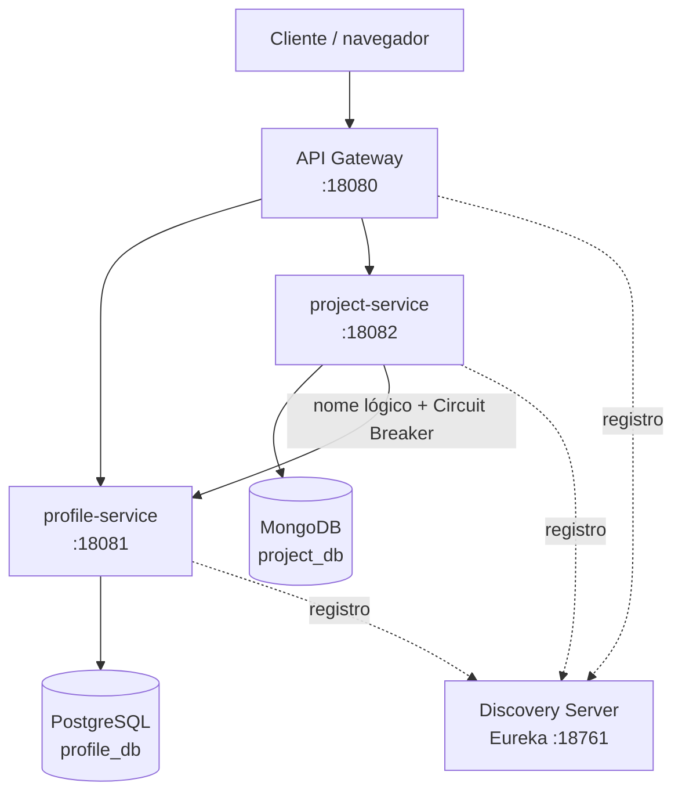

<div align="center">


# 💼 PortfolioHub · Microservices & DevOps

**Plataforma cloud-native para organizar perfil profissional e projetos técnicos**

<sub>DR3-TP1 · Bloco Engenharia de Softwares Escaláveis · Trabalho individual</sub>

<br/>

[](#-stack-tecnológica)
[](#-stack-tecnológica)
[](#-stack-tecnológica)
[](#-persistência-poliglota)
[](#-persistência-poliglota)
[](LICENSE)
[](#-status-da-entrega)

<br/>

[](docs/RELATORIO_TP1.md)

</div>

---

## 📚 Índice

1. [Visão geral](#-visão-geral)
2. [Arquitetura](#-arquitetura)
3. [Serviços e responsabilidades](#-serviços-e-responsabilidades)
4. [Persistência poliglota](#-persistência-poliglota)
5. [Stack tecnológica](#-stack-tecnológica)
6. [Pré-requisitos](#-pré-requisitos)
7. [Como executar](#-como-executar)
8. [Referência da API](#-referência-da-api)
9. [Resiliência](#-resiliência)
10. [Evidências e status](#-status-da-entrega)
11. [Estrutura](#-estrutura-do-projeto)
12. [Relatório técnico](#-relatório-técnico)

---

## 💡 Visão geral

O **PortfolioHub** organiza um perfil profissional e o catálogo de projetos técnicos em uma aplicação que pode evoluir de um trabalho acadêmico para um portfólio real.

O domínio foi dividido em dois contextos claros: **perfil profissional**, com dados estruturados e estáveis; e **portfólio de projetos**, com tecnologias, links e metadados naturalmente variáveis. Cada serviço é dono dos próprios dados e se comunica somente por contratos HTTP.

> **Bloco:** Engenharia de Softwares Escaláveis · **Disciplina:** Microsserviços e DevOps com Spring Boot e Spring Cloud [26E3_3] · **Trimestre:** 26E2  
> **Professor:** Wesley Bruno Barbosa Silva · **Aluno:** André Luis Becker · **Sala:** GRLENGR2C2-N2-L1  
> **Modalidade:** individual · **Data:** 21/ago/2026

### Responsabilidades

Trabalho **individual**: todos os módulos, bancos, documentação, testes e a organização da entrega são de responsabilidade do único integrante.

| Integrante | Microservices sob responsabilidade | Bancos | Demais papéis |
|---|---|---|---|
| André Luis Becker | `profile-service` · `project-service` | PostgreSQL · MongoDB | API Gateway, Discovery Server, documentação, testes e organização da entrega |

**Repositório:** https://github.com/andrebecker84/microservices-devops-portfolio-TP1

---

## 🏗️ Arquitetura



O **API Gateway** é a única fronteira externa. O **Eureka** registra e descobre os serviços por nome lógico, removendo URLs internas fixas. O detalhamento está no [relatório técnico](docs/RELATORIO_TP1.md) e as decisões, nos [ADRs](docs/adr/).

---

## 🧩 Serviços e responsabilidades

| Componente | Responsabilidade | Porta | Dados próprios |
|---|---|:---:|---|
| `discovery-server` | Registro e descoberta dinâmica | 18761 | — |
| `api-gateway` | Entrada externa e roteamento | 18080 | — |
| `profile-service` | Criação, leitura e atualização de perfis | 18081 | PostgreSQL · `profile_db` |
| `project-service` | Criação e consulta de projetos | 18082 | MongoDB · `project_db` |

`profile-service` concentra dados pessoais e de apresentação com regras de consistência claras. `project-service` concentra projetos com tecnologias, links e metadados heterogêneos. Não há serviços especulativos para experiências, formação ou analytics nesta entrega.

---

## 🗄️ Persistência poliglota

| Serviço | Banco | Justificativa |
|---|---|---|
| `profile-service` | PostgreSQL | Perfil possui estrutura estável e relações consistentes; usa migration Flyway. |
| `project-service` | MongoDB | Projetos têm tecnologias e metadados heterogêneos; o documento é recuperado naturalmente como uma unidade. |

Os bancos podem compartilhar uma instância local somente se permanecerem logicamente isolados. Nenhum serviço lê ou escreve diretamente o banco do outro.

---

## 🧰 Stack tecnológica

| Área | Tecnologia |
|---|---|
| Linguagem e build | Java 25 · Maven |
| Framework | Spring Boot 4.1.1 · Spring Cloud 2025.1.2 |
| Descoberta e entrada | Netflix Eureka · Spring Cloud Gateway (WebFlux) |
| Resiliência | Spring Cloud Circuit Breaker · Resilience4j |
| Dados | PostgreSQL · Spring Data JPA · Flyway · MongoDB |
| Observabilidade | Spring Boot Actuator (`health` e `info`) |
| Empacotamento | Docker multi-stage · Alpine JRE · usuário sem privilégio |

---

## ✅ Pré-requisitos

- **Docker** com Compose — é tudo o que a execução exige;
- Java 25 e Maven 3.9+ apenas para desenvolvimento fora de container;
- Um cliente HTTP: a coleção em [`http/`](http/) é do **IntelliJ HTTP Client**, que grava os identificadores automaticamente entre as requisições. Sem IntelliJ, os arquivos continuam legíveis e as chamadas são reproduzíveis com cURL.

> [!IMPORTANT]
> Não versione senhas, tokens, arquivos `.env`, certificados ou dados pessoais reais. A configuração sensível é fornecida por variáveis de ambiente.

---

## 🚀 Como executar

### 1. Defina as credenciais locais

```bash
cp .env.example .env
```

Edite o `.env` e preencha `PORTFOLIO_DB_PASSWORD` e `PORTFOLIO_MONGO_PASSWORD`. Use senhas **alfanuméricas** e **diferentes entre si**: a do MongoDB entra numa URI de conexão, onde `@ : / ? #` quebrariam o parsing. O Compose aborta com mensagem clara se alguma faltar — não existe caminho que suba o ambiente sem senha.

### 2. Suba tudo

```bash
docker compose up -d --build
```

Um comando, seis containers: PostgreSQL, MongoDB e os quatro módulos. A ordem de inicialização é garantida por `healthcheck` encadeado — o `discovery-server` precisa responder antes que os serviços de domínio subam, e estes antes do Gateway. Não há script de orquestração nem espera manual.

A primeira execução compila as quatro imagens e leva alguns minutos; as seguintes reaproveitam camadas.

### 3. Confirme

```bash
docker compose ps
```

Os seis precisam aparecer como `healthy`. Então:

1. Abra `http://localhost:18761` e confirme `API-GATEWAY`, `PROFILE-SERVICE` e `PROJECT-SERVICE` registrados;
2. Faça chamadas apenas pela porta `18080`;
3. Execute a coleção [`http/`](http/) na ordem — `00-infra`, `01-perfis`, `02-projetos`, `03-resiliencia`. Selecione o ambiente `local` antes de começar;
4. Para comprovar o fallback, derrube só um serviço:

```bash
docker compose stop profile-service
```

Repita `GET /api/projects/{id}/details`: o projeto continua sendo retornado, agora com `profile.status: UNAVAILABLE`. Restaure com `docker compose start profile-service`.

### Alternativa: execução local com Maven

Para o ciclo de desenvolvimento, com recompilação rápida e sem reconstruir imagem:

```bash
mvn -pl discovery-server spring-boot:run
```

Repita para `profile-service`, `project-service` e `api-gateway`, nessa ordem, em terminais separados. Nenhuma variável de ambiente é necessária: os `application.yml` leem o `.env` da raiz via `spring.config.import`. No Windows, o atalho `.\run` sobe os quatro em janelas próprias e monitora as portas.

> Neste modo os bancos ainda vêm do Compose, e as aplicações os alcançam em `localhost:18432` e `localhost:18017`.

### Opcional: TLS no tráfego interno

O tráfego entre containers roda em texto claro por padrão, o que é adequado a uma bridge local mas não a produção. Há um perfil que cifra JDBC, MongoDB e a chamada `project-service → profile-service`:

```bash
bash scripts/gerar-certificados.sh
```

Gera uma autoridade certificadora local e um certificado por serviço em `certs/`, que **não é versionado**. As chaves privadas nascem na sua máquina.

```bash
docker compose -f docker-compose.yml -f docker-compose.tls.yml up -d --build
```

O Gateway e o Eureka permanecem em HTTP: são a fronteira que o navegador acessa, e um certificado autoassinado ali só produziria alertas. Omitir o segundo `-f` volta ao ambiente sem TLS, sem editar arquivo algum.

---

## 🔌 Referência da API

> Todas as chamadas externas passam pelo Gateway: `http://localhost:18080`.

| Método | Rota | Resposta esperada | Descrição |
|---|---|---|---|
| POST | `/api/profiles` | `201 Created` | Cria um perfil |
| GET | `/api/profiles/{id}` | `200` ou `404` | Consulta um perfil |
| PUT | `/api/profiles/{id}` | `200` ou `404` | Atualiza um perfil |
| POST | `/api/projects` | `201 Created` | Cria um projeto |
| GET | `/api/projects` | `200` | Lista projetos |
| GET | `/api/projects/{id}` | `200` ou `404` | Consulta um projeto |
| GET | `/api/projects/{id}/details` | `200` | Projeto com perfil remoto/fallback |

---

## 🛡️ Resiliência

`project-service` chama `profile-service` em `GET /api/projects/{id}/details`. A descoberta usa o nome lógico `profile-service`; a chamada é protegida por **timeout** (2s de conexão, 3s de leitura) e **Circuit Breaker** com **fallback**.

| Situação | `profile.status` na resposta |
|---|---|
| Perfil obtido | `AVAILABLE` |
| Perfil não existe | `NOT_FOUND` |
| Serviço fora do ar, lento ou circuito aberto | `UNAVAILABLE` |

Em todos os casos os dados do projeto continuam sendo retornados. O timeout existe porque o Circuit Breaker conta falhas, não lentidão — sem ele, um serviço travado prenderia a requisição indefinidamente.

---

## 📋 Status da entrega

| Item | Situação |
|---|---|
| Arquitetura e módulos | ✅ Estrutura inicial criada |
| Isolamento de bancos | ✅ Configurado por serviço |
| Gateway, Eureka e resiliência | ✅ Implementados e **validados em execução** |
| Containerização | ✅ Seis containers, ordem por healthcheck, processo sem root |
| Migração PostgreSQL | ✅ Flyway `V1__create_profiles.sql` |
| Requisições de demonstração | ✅ Arquivo `.http` incluído |
| Testes automatizados | ✅ 12 testes unitários passando |
| Decisões arquiteturais | ✅ ADRs em `docs/adr/` |
| Evidências visuais | ⏳ A capturar após execução |
| Portas | ✅ Faixa `18xxx` dedicada, publicadas só em `127.0.0.1` |

---

## 📁 Estrutura do projeto

```text
microservices-devops-portfolio-TP1/
├── discovery-server/             # Eureka Server
├── api-gateway/                  # ponto único de entrada
├── profile-service/              # PostgreSQL + Flyway
├── project-service/              # MongoDB + Circuit Breaker
├── Dockerfile                    # imagem única, parametrizada por módulo
├── docker-compose.yml            # os 6 containers e a rede isolada
├── .env.example                  # modelo de credenciais (o .env não é versionado)
├── scripts/gerar-certificados.sh # CA local para TLS (opcional)
├── http/                         # coleção HTTP, um arquivo por evidência
├── docs/
│   ├── RELATORIO_TP1.md
│   ├── context/                  # enunciado e rúbrica da atividade
│   ├── evidences/                # capturas de execução
│   └── adr/
│       ├── 001-persistencia-poliglota.md
│       ├── 002-comunicacao-resiliente.md
│       └── 003-discovery-gateway.md
├── .gitignore
├── LICENSE
├── pom.xml
└── README.md
```

---

## 📄 Relatório técnico

O [relatório técnico](docs/RELATORIO_TP1.md) detalha decisões, cobertura da rúbrica e as evidências a coletar antes da entrega.

## 📜 Licença

Copyright © 2026 André Luis Becker. Todos os direitos reservados.

Este repositório é **de código visível (source-available), não de código aberto**. É público para ser lido, estudado e avaliado — e o corpo docente da instituição avaliadora pode executá-lo livremente para conferir a entrega. Qualquer outro uso, incluindo clonar, executar, modificar ou redistribuir, depende de autorização escrita.

Os termos completos, com o anexo de proteção de dados (LGPD), estão na [LICENSE](LICENSE). Pedidos de autorização são gratuitos: abra uma [issue](https://github.com/andrebecker84/microservices-devops-portfolio-TP1/issues).
