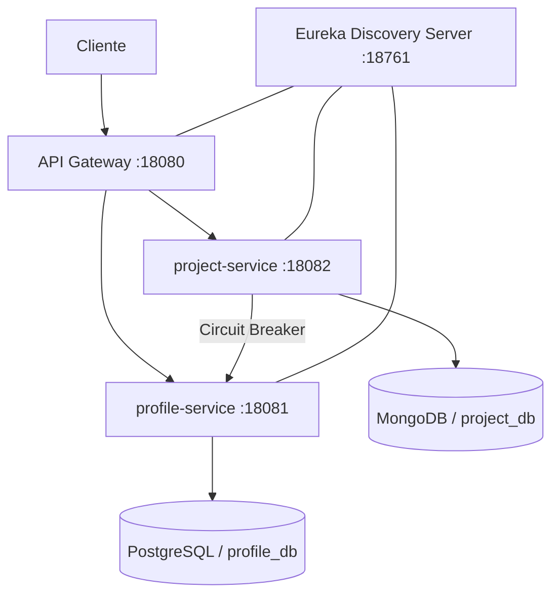
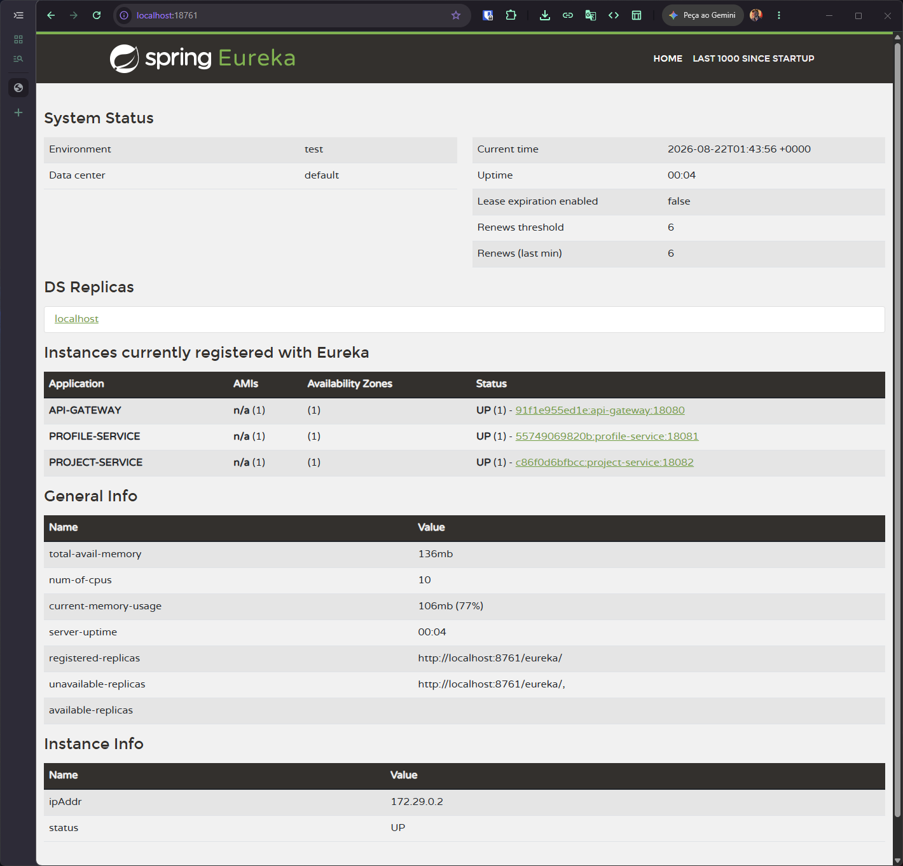
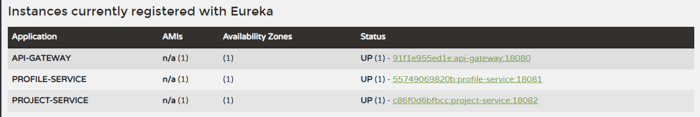
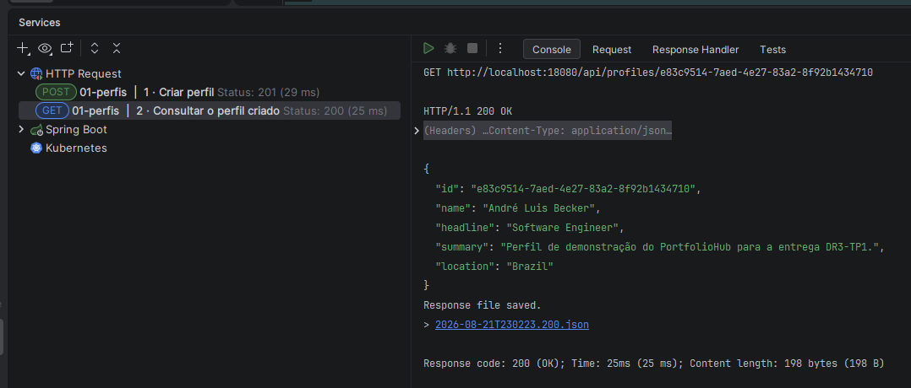
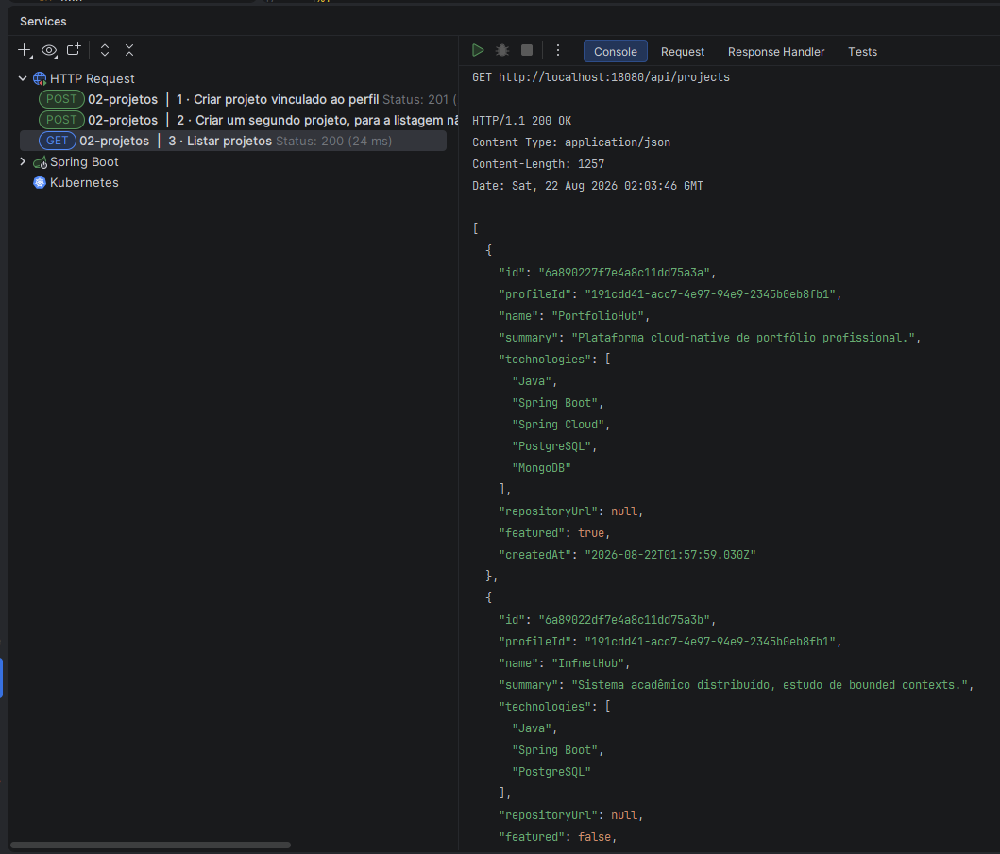
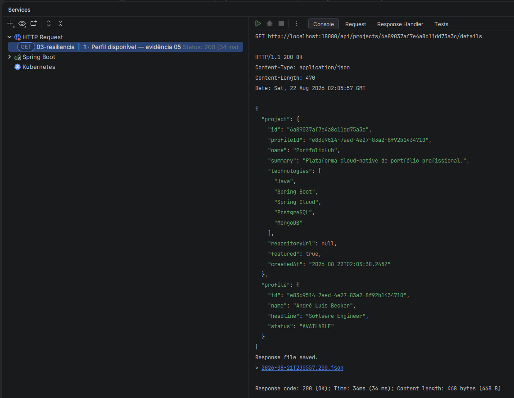
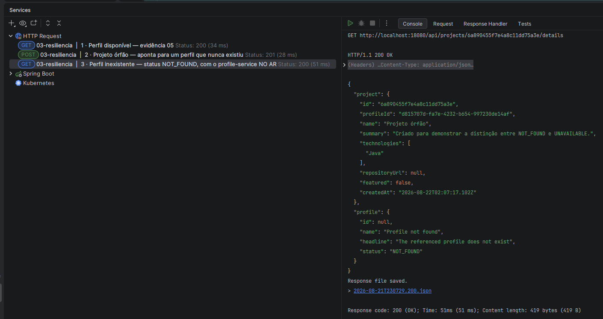
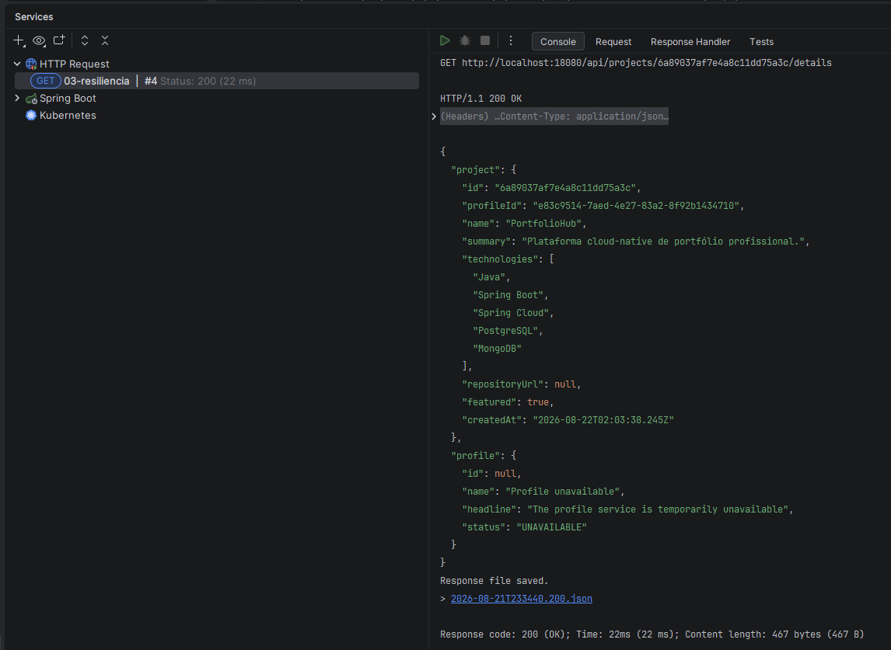
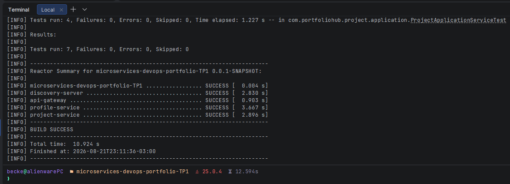
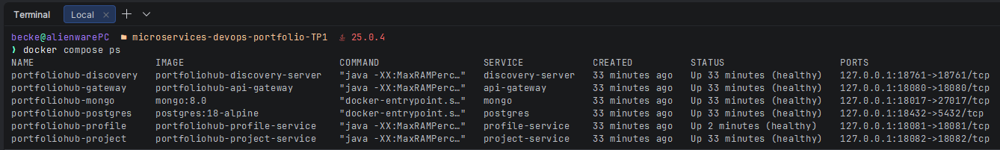

# Relatório Técnico — PortfolioHub

> **Bloco:** Engenharia de Softwares Escaláveis  
> **Disciplina:** Microsserviços e DevOps com Spring Boot e Spring Cloud [26E3_3]  
> **Trimestre:** 26E2  
> **Professor:** Wesley Bruno Barbosa Silva  
> **Aluno:** André Luis Becker  
> **Sala:** GRLENGR2C2-N2-L1  
> **Entrega:** DR3-TP1 — Proposta e Arquitetura Inicial de Microservices  
> **Modalidade:** Individual  
> **Data:** 21/ago/2026

---

## 1. Resumo executivo

O **PortfolioHub** é uma plataforma de portfólio profissional. A primeira versão organiza informações de perfil e projetos técnicos em uma arquitetura distribuída simples, funcional e evolutiva. O currículo não é tratado como página estática: seus dados são parte do domínio da aplicação.

A arquitetura possui dois microservices de domínio, quantidade mínima exigida para o trabalho individual, além de Discovery Server e API Gateway. A persistência é poliglota: PostgreSQL atende os dados estruturados de perfil, enquanto MongoDB atende o catálogo flexível de projetos.

## 2. Problema, usuários e escopo

### Problema

Profissionais precisam apresentar perfil, competências e projetos sem manter informações espalhadas entre currículos, repositórios e páginas independentes. O PortfolioHub centraliza esse conteúdo e permite evolução gradual para uma vitrine profissional.

### Usuários

- visitante interessado no portfólio;
- proprietário/administrador futuro do portfólio.

### Escopo desta entrega

- criar, consultar e atualizar um perfil profissional;
- criar e consultar projetos técnicos;
- expor os serviços por Gateway;
- demonstrar descoberta de serviços, persistência separada e resiliência.

Experiência, formação, certificações, busca, autenticação completa, mensageria e analytics ficaram fora do escopo para evitar fragmentação prematura.

## 3. Arquitetura proposta

| Componente | Papel |
|---|---|
| Eureka | Registro e descoberta dinâmica por nome lógico. |
| API Gateway | Entrada externa e roteamento de `/api/profiles/**` e `/api/projects/**`. |
| Actuator | Informações mínimas de saúde para validação local. |

As portas, URLs de Eureka e conexões dos bancos são externalizadas por variáveis de ambiente. Cada serviço possui servidor embutido, pode iniciar independentemente e pode escalar sem acoplamento com endereços físicos.

### Escalabilidade e características cloud-native

A combinação de **descoberta dinâmica** e **roteamento centralizado** é o que permite escalar horizontalmente sem reconfigurar nada:

- **Instâncias são descartáveis.** Uma nova instância de `project-service` sobe, registra-se no Eureka e passa a receber tráfego sem que Gateway ou `profile-service` conheçam seu endereço. Ao ser encerrada, sai do registro e para de receber chamadas. Não há lista de hosts para manter.
- **Balanceamento pelo nome lógico.** `project-service` chama `http://profile-service`, não um IP. O Spring Cloud LoadBalancer distribui entre as instâncias registradas, então escalar o `profile-service` é subir mais processos — nenhuma alteração de código ou configuração no chamador.
- **Fronteira estável.** O cliente externo conhece apenas `:18080`. A topologia interna pode mudar de uma para N instâncias por serviço sem afetar o contrato público.
- **Configuração externalizada.** Portas, URL do Eureka e conexões de banco vêm do ambiente, permitindo que o mesmo artefato rode em máquinas e ambientes distintos sem recompilação — o que torna a imagem de cada serviço promovível entre ambientes.
- **Estado fora do processo.** Os serviços não guardam estado em memória entre requisições; o estado vive no PostgreSQL e no MongoDB, condição necessária para que instâncias sejam intercambiáveis.
- **Falha parcial isolada.** O Circuit Breaker impede que a indisponibilidade de um serviço se propague em cascata, requisito para operar com muitas instâncias, onde falhas individuais são rotina e não exceção.

Os limites atuais estão documentados: nesta entrega os dois bancos compartilham a mesma máquina local, e a evolução prevista é uma instância por serviço, reforçando o isolamento.

## 4. Microservices e dados

| Serviço | Responsabilidade | Dados | Banco | Justificativa |
|---|---|---|---|---|
| `profile-service` | Gerenciar apresentação profissional | nome, headline, resumo e localização | PostgreSQL / `profile_db` | Dados estruturados e consistentes; migration Flyway controlada. |
| `project-service` | Gerenciar catálogo técnico | nome, resumo, tecnologias, links e destaque | MongoDB / `project_db` | Projetos têm metadados e tecnologias heterogêneos, adequados a documentos flexíveis. |

Cada serviço possui conexão própria e não acessa o banco do outro. Um projeto armazena `profileId` como referência, mas o perfil permanece sob propriedade exclusiva do `profile-service`.

## 5. Contratos REST

| Método | Rota no Gateway | Função |
|---|---|---|
| POST | `/api/profiles` | Criar perfil |
| GET | `/api/profiles/{id}` | Consultar perfil |
| PUT | `/api/profiles/{id}` | Atualizar perfil |
| POST | `/api/projects` | Criar projeto |
| GET | `/api/projects` | Listar projetos |
| GET | `/api/projects/{id}` | Consultar projeto |
| GET | `/api/projects/{id}/details` | Consultar projeto e perfil remoto |

Os controllers trabalham com DTOs, Bean Validation e respostas HTTP adequadas. Recursos inexistentes retornam `404`, sem expor detalhes internos.

## 6. Comunicação e resiliência

O fluxo demonstrativo é `project-service → profile-service`, utilizado para compor os detalhes de um projeto com o autor. A chamada usa `http://profile-service`, resolvido pelo LoadBalancer com os registros do Eureka.

O cliente remoto combina **timeout** e **Circuit Breaker (Resilience4j)** com **fallback**:

| Quem chama | Quem é chamado | Risco | Estratégia | Comportamento observável |
|---|---|---|---|---|
| `project-service` | `profile-service` | Serviço fora do ar | Circuit Breaker + fallback | Projeto retornado; perfil com `status: UNAVAILABLE` |
| `project-service` | `profile-service` | Resposta lenta / rede instável | Timeout (2s conexão, 3s leitura) → falha → Circuit Breaker | Idem, sem prender a requisição |
| `project-service` | `profile-service` | Perfil inexistente (referência inválida) | Tratamento explícito do `404` | Projeto retornado; perfil com `status: NOT_FOUND` |

O timeout existe porque o Circuit Breaker conta **falhas**, não **lentidão**: sem ele, um `profile-service` travado deixaria a chamada pendurada indefinidamente e o circuito nunca abriria. O timeout converte lentidão em falha, que é o que o Resilience4j sabe tratar.

A distinção entre `NOT_FOUND` e `UNAVAILABLE` é deliberada. Um perfil inexistente é uma resposta legítima do serviço remoto, não uma falha dele — tratá-lo como indisponibilidade abriria o circuito por causa de dado inválido do cliente, penalizando um serviço saudável e escondendo do consumidor a diferença entre um dado errado e uma falha de infraestrutura.

Nos três casos o projeto continua sendo retornado: evita-se a falha em cascata sem ocultar a condição real.

**Como simular:** interromper o `profile-service` e repetir `GET /api/projects/{id}/details` produz `UNAVAILABLE`; consultar um projeto cujo `profileId` não exista produz `NOT_FOUND` com o `profile-service` no ar.

## 7. Organização e qualidade

A estrutura é pragmática e inspirada em arquitetura hexagonal:

- `adapter/in/web`: controllers e contratos HTTP;
- `application`: casos de uso e orquestração;
- `adapter/out/persistence`: entidades/documentos e repositórios Spring Data;
- `config`: componentes técnicos, como cliente HTTP balanceado.

Controllers são finos, dependências são injetadas por construtor e não há serviços extras sem necessidade de domínio. A migration do PostgreSQL fica em `db/migration`; MongoDB persiste documentos próprios do contexto de projetos. As decisões arquiteturais relevantes estão registradas em `docs/adr/`.

## 8. Como reproduzir

1. Copiar `.env.example` para `.env` e definir `PORTFOLIO_DB_PASSWORD` e `PORTFOLIO_MONGO_PASSWORD` (o `.env` não é versionado).
2. Executar `docker compose up -d --build`. Um único comando sobe os seis containers: PostgreSQL, MongoDB e os quatro módulos.
3. Conferir com `docker compose ps` — os seis devem aparecer como `healthy`.
4. Acessar `http://localhost:18761` e confirmar os três serviços registrados.
5. Executar a coleção `http/` pela porta `18080`, na ordem dos arquivos.
6. Para validar a resiliência, `docker compose stop profile-service` e repetir a rota de detalhes.

A ordem de inicialização não depende de intervenção: o `depends_on` com `condition: service_healthy`
encadeia bancos → Discovery Server → serviços de domínio → Gateway. Quem clona o repositório
reproduz a infraestrutura inteira sem instalar Java, Maven, PostgreSQL ou MongoDB na máquina.

## 9. Evidências de execução

As capturas abaixo foram obtidas com o ambiente completo em execução, em 21 de agosto de 2026.
Todas as chamadas de aplicação passam pela porta `18080`, do API Gateway.

*Figura 1 — Discovery Server (Eureka) em execução na porta 18761*

*Figura 2 — Microservices registrados no Discovery Server*

*Figura 3 — Criação e consulta de perfil através do API Gateway*

*Figura 4 — Criação e listagem de projetos através do API Gateway*

*Figura 5 — Comunicação entre microservices: perfil obtido (`AVAILABLE`)*

*Figura 6 — Perfil inexistente distinguido como `NOT_FOUND`, sem abrir o circuito*

*Figura 7 — Circuit Breaker em ação: `profile-service` indisponível (`UNAVAILABLE`)*

*Figura 8 — Suíte de testes automatizados — `BUILD SUCCESS`*

*Figura 9 — Ecossistema completo em containers, com healthcheck*

As figuras 5, 6 e 7 formam o núcleo da demonstração de resiliência: a mesma rota
`GET /api/projects/{id}/details` respondendo `200` nos três cenários possíveis — perfil obtido,
perfil inexistente e serviço remoto fora do ar. Em nenhum deles a falha se propaga: o projeto
continua sendo retornado, e o campo `profile.status` informa a condição real.

## 9.1. Empacotamento e execução em containers

Os quatro módulos são construídos por um `Dockerfile` único, parametrizado pelo módulo — não há
quatro arquivos quase idênticos a manter em sincronia. O build é multi-stage: um estágio compila com
Maven e JDK, e a imagem final carrega apenas o JRE Alpine e o jar. O compilador não sobrevive ao
empacotamento, e cada binário ausente é uma superfície de ataque a menos.

Três decisões de segurança acompanham o empacotamento:

- **Processo sem privilégio.** Os containers rodam como usuário não-root criado na imagem.
- **Portas restritas ao loopback.** As seis portas são publicadas em `127.0.0.1`, não em `0.0.0.0`.
  A forma padrão do Docker exporia os bancos a qualquer máquina da rede local.
- **Faixa dedicada `18xxx`.** Evita colisão com outros serviços na máquina de desenvolvimento.

A JVM recebe `-XX:MaxRAMPercentage=75`: sem isso ela dimensiona o heap pela memória do hospedeiro,
ignora o limite do container e é encerrada por falta de memória.

## 9.2. Três defeitos que só a execução real revelou

A verificação em execução expôs três defeitos que a compilação e os testes unitários não
alcançavam. Todos são característicos da migração para o Spring Boot 4, e os três falhavam em
silêncio — sem erro de compilação, sem aviso em log:

**A propriedade do MongoDB estava sendo ignorada.** O projeto usava `spring.data.mongodb.uri`, que
foi depreciada com nível `error` no Boot 4.0 e substituída por `spring.mongodb.uri`. O Spring a
descartava em silêncio e caía no default `mongodb://localhost/test`. Como o valor configurado
localmente também apontava para `localhost`, o resultado coincidia com o default e o defeito era
invisível. Só apareceu quando o host passou a ser `mongo`, dentro da rede do Compose.

**O `@LoadBalanced` capturava o transporte do Eureka.** O `RestClient.Builder` balanceado era o
único bean desse tipo no contexto, então o auto-configure do Spring Boot recuava e o próprio cliente
do Eureka o adotava — tentando resolver `discovery-server` pelo LoadBalancer, que depende do Eureka.
Referência circular: o `project-service` não se registrava e nenhuma chamada por nome lógico
funcionava. O disfarce era perfeito, porque a falha caía no fallback e devolvia `UNAVAILABLE`, que é
exatamente o comportamento esperado quando o serviço remoto está fora. A correção declara um builder
comum `@Primary` para quem injeta sem qualificador, mantendo o balanceado acessível via
`@LoadBalanced`, que é um qualificador.

**O `@CircuitBreaker` era uma anotação inerte.** O Spring Boot 4 removeu `spring-boot-starter-aop`
do seu BOM. Sem `aspectjweaver` no classpath, o aspecto que implementa a anotação nunca é criado:
o método executa desprotegido, o fallback jamais é chamado e a exceção sobe até o controller. Com o
`profile-service` interrompido, a rota devolvia `500` em vez de degradar. O código compilava, subia
e não emitia aviso algum — a anotação simplesmente não fazia nada.

O segundo e o terceiro casos são os mais instrutivos da entrega: um mecanismo de resiliência bem construído pode
esconder uma falha de configuração, porque degradar com elegância e estar quebrado produzem a mesma
resposta. Só a verificação em execução real distingue os dois.

## 10. Cobertura da rúbrica

| Critério | Como o projeto atende | Situação atual |
|---|---|---|
| Arquitetura distribuída | Diagrama e documentação de Gateway, Eureka e dois serviços de domínio | ✅ Documentado |
| Tema e granularidade | Perfil e projetos são contextos separados e justificáveis | ✅ Documentado |
| Ecossistema funcional | Seis containers com healthcheck encadeado | ✅ Figuras 1, 2 e 9 |
| Cloud-native/escalabilidade | Configurações externalizadas e descoberta dinâmica | ✅ Validado em execução |
| Isolamento de estado | `profile_db` e `project_db`, sem acesso cruzado | ✅ Configurado |
| Serviços independentes | Faixa dedicada 18xxx, só em loopback | ✅ Validado em execução |
| Resiliência | Timeout, Circuit Breaker e fallback com três estados | ✅ Figuras 5, 6 e 7 |
| Gateway | Rotas públicas para perfil e projeto | ✅ Figuras 3, 4 e 5 |
| API REST | DTOs, validação e endpoints de domínio | ✅ Implementado |
| Testes | Unitários dos dois serviços + comportamento de fallback | ✅ 12 testes — Figura 8 |
| Decisões arquiteturais | ADRs de persistência, resiliência e discovery/gateway | ✅ `docs/adr/` |
| Repositório e README | Estrutura e instruções presentes | ⏳ publicar repositório |
| Evidências visuais | Nove capturas em `docs/evidences/` | ✅ Figuras 1 a 9 |

## 11. Pendências para conclusão

1. Exportar o documento da proposta para PDF.
2. Publicar o repositório Git com o README de execução.

## 12. Conclusão

O PortfolioHub apresenta uma base coerente para a Entrega 1: dois microservices de domínio, bancos logicamente isolados, Discovery Server, API Gateway e uma estratégia explícita de resiliência. A qualidade da entrega final dependerá da validação real, das evidências anexadas e das instruções de execução reproduzíveis no repositório.
